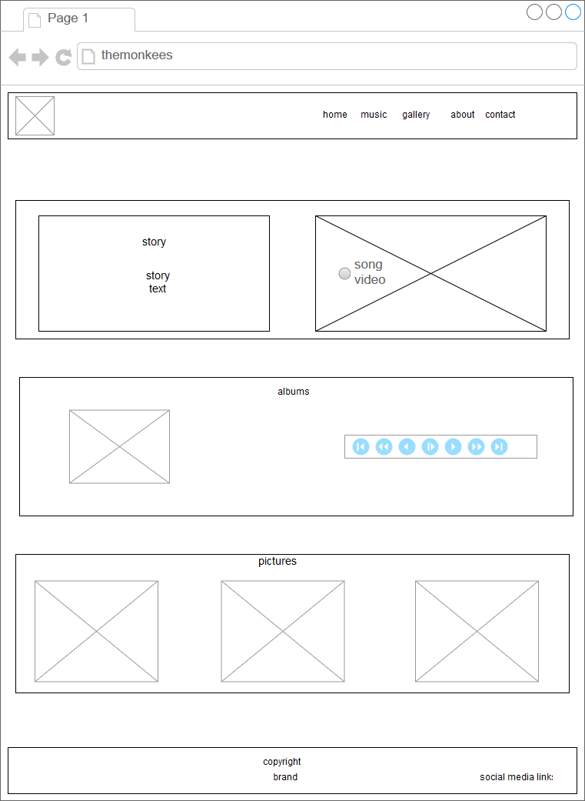
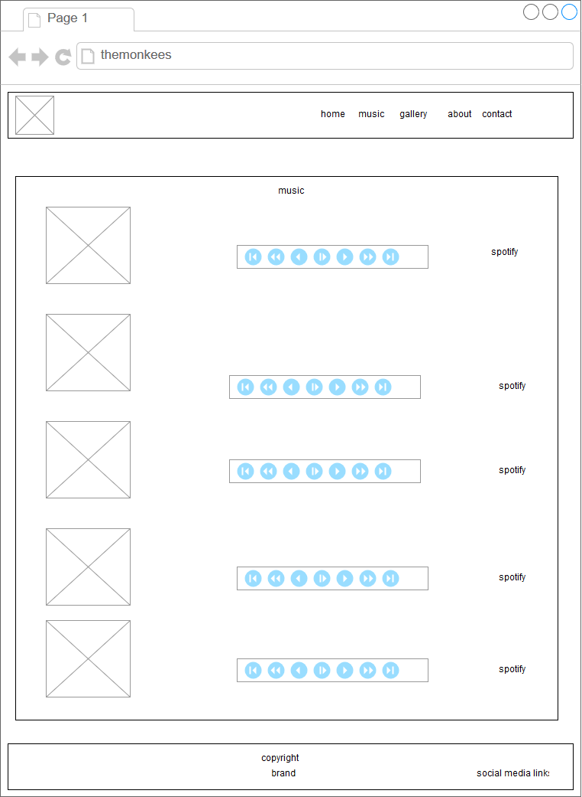
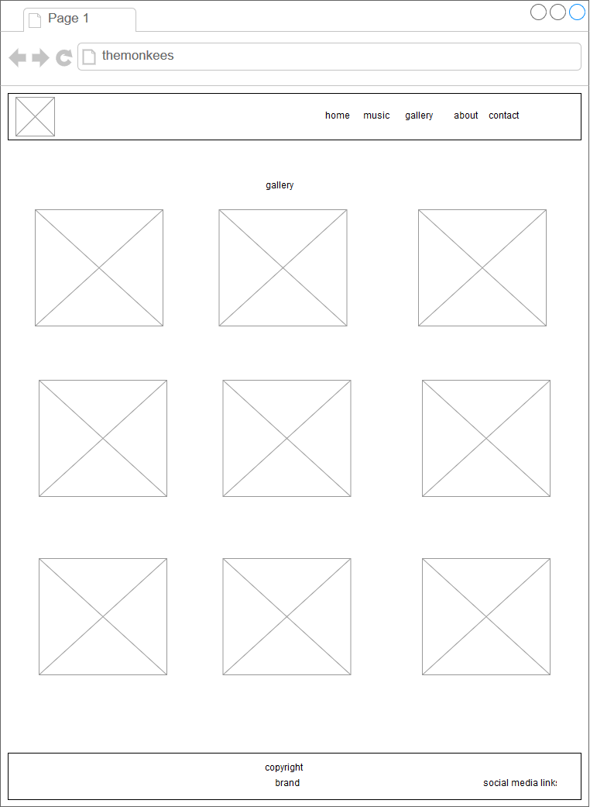
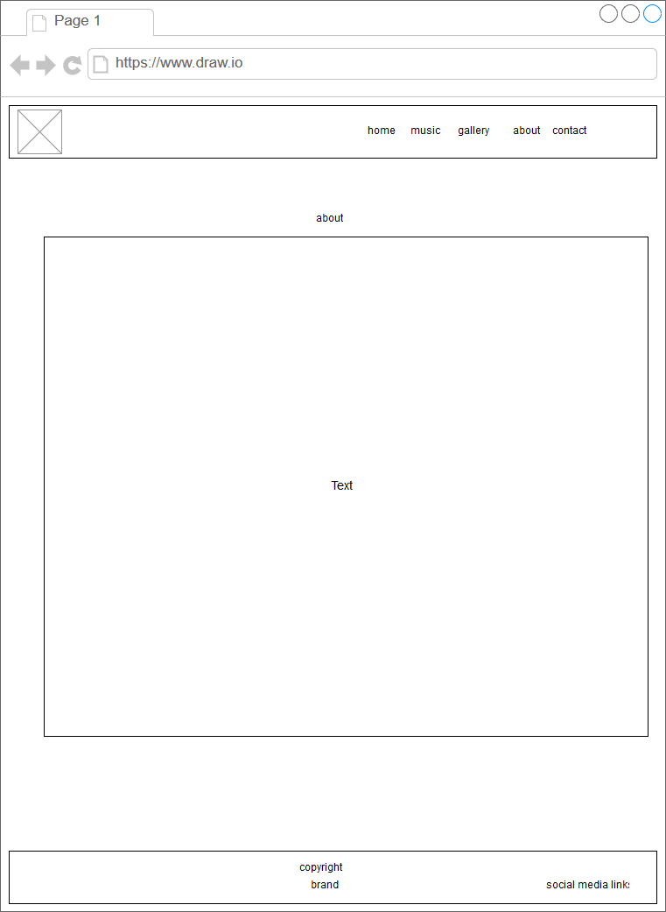
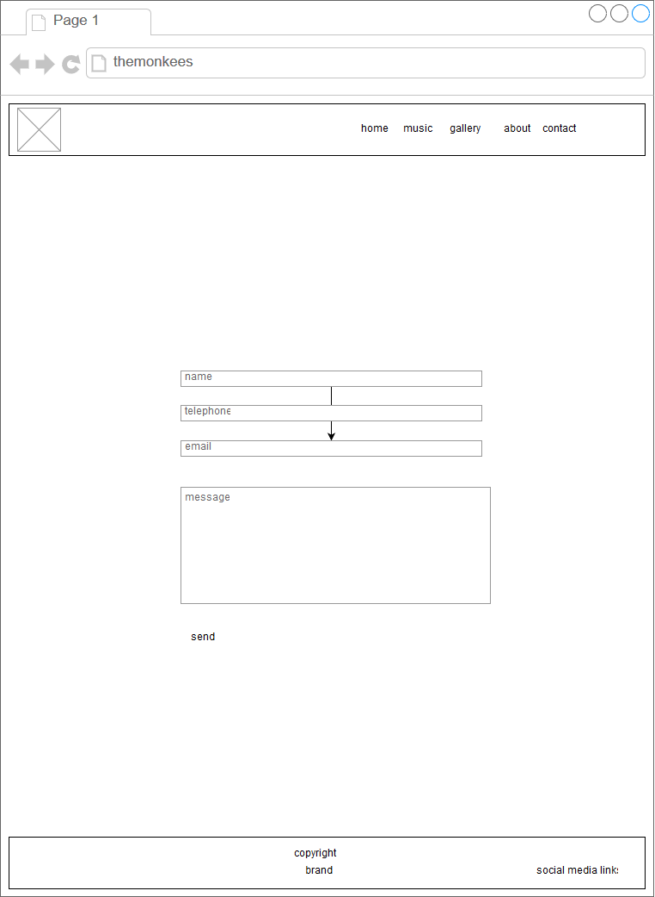

# Milestone project 1
## Website for The Monkees Band

This website was designed for the fans of the band, it provides information and biography of the band, giving the oportunity to listen to samples of the songs, showing pictures organised in a gallery, allowing the fans to engage through social media presence of the band.

The website can be viewed here:
https://rafocus.github.io/milestone-project-1/index.html

## UX

The philosophy followed in the design of this website is clarity and minimalist style to present the content efficiently. The choice of background pictures and colors is intended to immerse the fans in the muscial style of the band. 

Wireframes of the web pages were created to give a guidance to the visual and functional characterstics of the intended final design.

  
 

## Features

### Existing Features

* Main page with brief introduction to the band with a video clip and a biography, sample song, few pictures of the band, a footer with links to social media.
* Music page with many songs samples
* An extended photo gallery 
* Dedicated page with full biography
* A contact page to provide the apportunity for users to engage with the band.

### Features Left to Implement
* Offer the option to purchase music directly from the website
* Book tickets for events
* Display fans comments from social media
* Fetch tweets and news

## Technologies Used

* Bootstrap 4
* Font awesome 
* Lightbox
* Google fonts
* Bootstrap 4 dependencies like jQuery and Popper

## Testing

All functionalities were successfully tested with the major browsers to check the responsive and correct display and behaviour of the page elements.

## Deployment

The website was depoyed to Github pages. Git was used locally and remotely for version control.

https://rafocus.github.io/milestone-project-1/index.html

## Credits

### Content

The text for the storyand about section copied from the (https://en.wikipedia.org/wiki/The_Monkees)

### Media

The photos, video, songs used in this site were provided by Code Institute, https://github.com/Code-Institute-Org/project-assets

### Acknowledgements

I received inspiration for this project from:

* http://www.oasisinet.com/#!/home
* http://music.iamlights.com/
