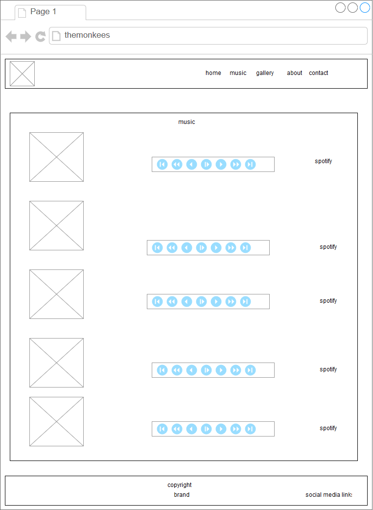
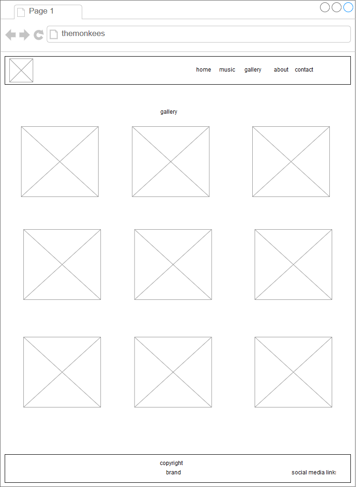
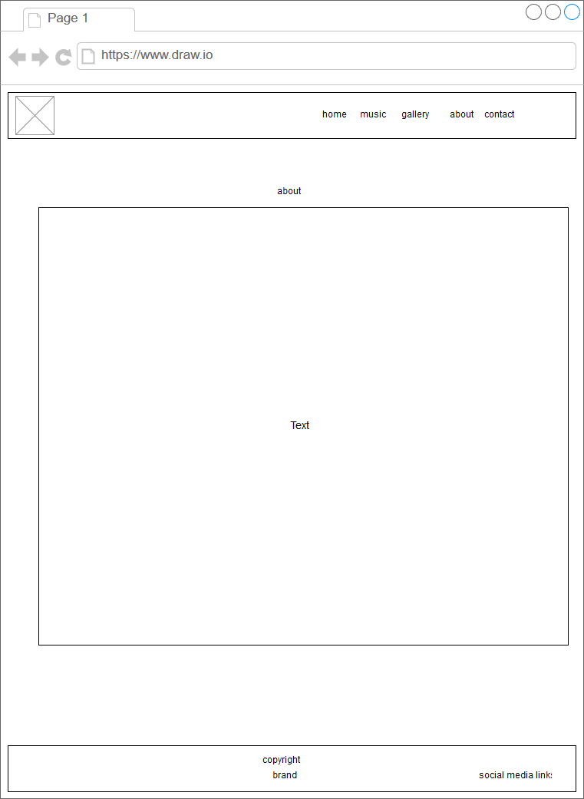
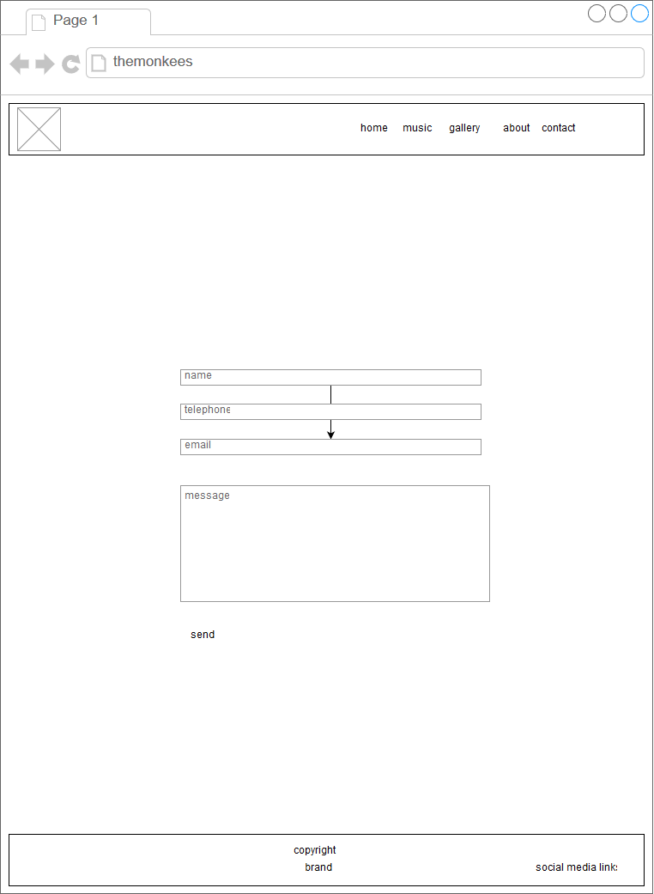

# Milestone project 1
## Website for The Monkees Band

this website is designed for the fans of the band, it provides information and biography of the band, giving the oportunity to listen to samples of the songs, showing pictures organised in a gallery, allowing the fans to engage through social media presence of the band.
 
## UX

The philosophy followed in the design of this website is clarity and minimalist style to present the content efficiently. The choice of background pictures and colors is intended to immerse the fans in the muscial style of the band. 

AIn the follwing frames a mockup of the web pages was created to give a guidance to the visual and functional characterstics of the intended final diesgn.

## Features

### Existing Features

* Main page with brief introduction to the band with a video clip and a biography, sample song, few pictures of the band, a footer with links to social medi.
* Music page with many songs samples
* An extended photo gallery 
* Dedicated page with full biography
* a Contact page to provide apportunity to users to engage with the band.

### Features Left to Implement
* Offer the option to purchase music directly from the website
* Book tickets for events
* Display fans comments from social media
* Fetch tweets and news

## Technologies Used

* Bootstrap 4
* Font awesome 
* Lightbox
* Google fonts
* Bootstrap 4 dependencies like jQuery and Popper

## Testing

All functionalities were successfully tested with the major browsers to check the responsive and correct display and behaviour of the page elements.

## Deployment

the website depoyed to Github pages, git was used localy and remotely for version control.

## Credits

### Content
- The text for the storyand about section copied from the (https://en.wikipedia.org/wiki/The_Monkees)

### Media
- The photos, video, songs used in this site were provided by Code Intitute

### Acknowledgements

- I received inspiration for this project from:

* http://www.oasisinet.com/#!/home
* http://music.iamlights.com/
